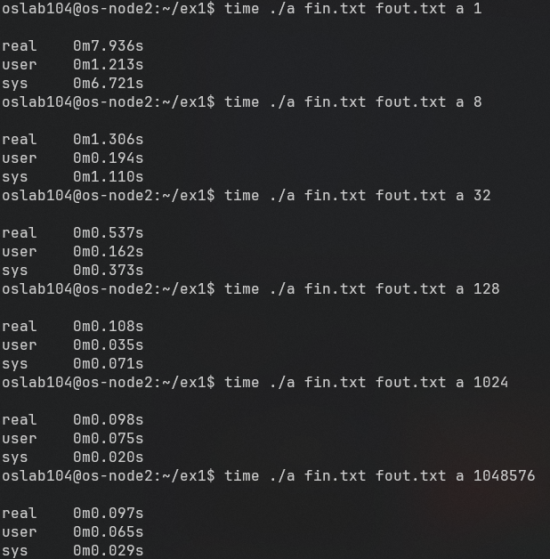

#  1η Εργαστηριακή Άσκηση
## 1) Ανάγνωση και εγγραφή αρχείων στη C και με τη βοήθεια κλήσεων συστήματος
Στο πρώτο μέρος της άσκησης ζητείται να υλοποιήσουμε πρόγραμμα `a1.1-system_calls.c` με την ίδια λειτουργικότητα του `a1.1-C.c` χωρίς την χρήση συναρτήσεων για επεξεργασία αρχείου από την `stdio.h`. 

Να σημειωθεί πως για την εκτύπωση πιθανών λαθών θεωρήσαμε αποδεκτή την χρήση της `printf()`  

### Έλεγχος παραμέτρων
Αν και δεν υποστηρίζεται από το `a1.1-C.c` προσθέσαμε τον παρακάτω στοιχειώδη έλεγχο:
```c
if(argc != 4 && argc != 5){
    printf("Incorrect number of arguments provided\n");
    return -1;
}
```
```c
if(strlen(argv[3]) > 1){
    printf("Program does not support matching >1 character\n");
    return -1;
}
```
### Άνοιγμα και κλείσιμο αρχείων
Για να ανοίξουμε το αρχείο εισόδου καλούμε την `int fdr = open(argv[1], O_RDONLY | O_CREAT, 0666);`

Αν το αρχείο υπάρχει, η συνάρτηση επιστρέφει έναν _file descriptor_ τον οποίο θα χρησιμοποιήσουμε αργότερα μόνο για να διαβάσουμε από αυτό (`O_RDONLY`)

Διαφορετικά, λόγω του _flag_ `O_CREAT`, ο _file descriptor_ θα αναφέρεται σε ένα νέο άδειο αρχείο με το ίδιο όνομα. Το νέο αρχείο θα έχει τα επιθυμητά permissions `-rw-rw-rw-` που προσδιορίζει το τελευταίο όρισμα `0666`

Αντίστοιχα για το αρχείο εξόδου: `int fdw = open(argv[2], O_WRONLY | O_CREAT | O_TRUNC, 0666);`

Αν το αρχείο υπάρχει, η συνάρτηση επιστρέφει έναν _file descriptor_ τον οποίο χρησιμοποιούμε μόνο για να γράψουμε σε αυτό (`O_RDONLY`)

Λόγω του _flag_ `O_CREAT`, αν το αρχείο δεν είναι κενό, τα περιεχόμενα του θα σβηστούν

Αν το αρχείο δεν υπάρχει, λόγω του _flag_ `O_CREAT` και του τρίτου ορίσματος `0666`, ο _file descriptor_ θα αναφέρεται σε ένα νέο άδειο αρχείο με το ίδιο όνομα, με permissions `-rw-rw-rw-` 

Σε περίπτωση πιθανού λάθους κατά την εκτέλεση της `open()` επιστρέφεται `-1`. Ελέγχουμε και χηριζόμαστε κατάλληλα αυτή την περίπτωση όπως φαίνεται παρακάτω 

```c
if(fdr < 0){
    printf("Problem opening file: %s to read\n", argv[1]);
    return -1;
}
```

Αργότερα, για να κλείσουμε τα ανοιχτά αρχεία καλούμε `close(fdr)` και `close(fdw)`

### Ανάγνωση από αρχείου εισόδου

Για να διαβάσουμε από το αρχείο που προηγουμένως ανοίξαμε χρησιμοποιούμε την κλήση συστήματος `read()`. Συγκεκριμένα η εντολή: `read_sz = read(fdr, buff, batch_sz);`
- Δέχεται ως πρώτο όρισμα τον _file descriptor_ `fdr` που αντιστοιχεί στο αρχείο εισόδου
- Δέχεται ως δεύτερο όρισμα έναν πίνακα από χαρακτήρες `buff` όπου θα αποθηκευτούν τα bytes που διαβάζονται
- Δέχεται ως τρίτο όρισμα το πλήθος bytes που θα θέλαμε να διαβαστούν `batch_sz`. Σε περίπτωση που μέχρι το τέλος του αρχείου υπάρχουν λιγότερα bytes από όσα ζητήσαμε θα διαβαστούν όλα μέχρι το τέλος του χωρίς πρόβλημα
- Επιστρέφει το πλήθος bytes που πραγματικά διαβάστηκε `read_sz`

O `fdr` αντιστοιχίζεται με έναν δείκτη που δείχνει σε κάποιο byte του αρχείου. Αμέσως αφου ανοίξουμε το αρχείο αυτός δείχνει στο πρώτο byte. Κάθε φορά που εκτελείται η παραπάνω εντολή ο δείκτης προχωράει μπροστά `read_sz` bytes

Συνεπώς, για να διαβάζουμε όλο το αρχείο, μπορούμε να το επεξεργαζόμαστε σε κομμάτια μεγέθους `batch_sz`. Με αυτόν τον τρόπο, ο buffer που χρειαζόμαστε αρκεί να έχει επίσης μέγεθος `batch_sz` 

```c
char buff[batch_sz];
```

Έχοντας τοποθετήσει τα περιεχόμενα του τρέχοντος κομματιού στον `buff`, εύκολα τον διατρέχουμε για να μετρήσουμε τις εμφανίσεις του ζητούμενου χαρακτήρα

Μπορούμε να αντιληφθούμε ότι έχουμε φτάσει στο τέλος του αρχείου αν `read_sz != batch_sz`

```c
do{
    read_sz = read(fdr, buff, batch_sz);
    for(int i = 0; i < read_sz; i++)
        cnt += buff[i] == argv[3][0];
}while(read_sz == batch_sz);
```

Θα μπορούσαμε για έλεγχο λάθους κατά την ανάγνωση να προσθέσουμε:

```c
if(read_sz < 0){
    printf("Problem reading from file %s\n", argv[1]);
    return -1;
}
```

Επειδή θέλαμε να μπορούμε εύκολα να μεταβάλλουμε το μέγεθος των κομματιών που χρησιμοποιούμε για ανάγνωση, ορίσαμε ως πέμπτο, προαιρετικό όρισμα της `main` το `batch_sz`. Ως default τιμή του ορίσαμε τα 1024 bytes

```c
const int batch_sz = (argv[4] == NULL ? 1024 : atoi(argv[4]));
```

Δοκιμάζοντας διαφορετικές τιμές για το μέγεθος του buffer πήραμε τους εξής χρόνους εκτέλεσης:



Μέχρι κάποιο μέγεθος η αύξηση του, του `batch_sz` μειώνει τον χρόνο εκτέλεσης. Αυτό είναι λογικό εφόσον μειώνονται οι κλήσεις συστήματος (λόγω του `read()`) και άρα μειώνεται ο χρόνος `sys`. Επίσης βλέπουμε πως μειώνεται και ο χρόνος `user`, γεγονός το οποίο είναι περίεργο εφόσον τελούνται οι ίδιοι αριθμοί συγκρίσεων-πράξεων ανεξαρτήτως του `batch_sz`. Όμως κανείς πρέπει να σκεφτεί πως για μεγαλύτερο `batch_sz` έχουμε μεγαλύτερο `buffer`, επομένως και καλύτερο `cache locality`, τόσο επειδή επειδή οι τιμές που διαβάζουμε βρίσκονται σε γειτονικές θέσης μνήμης (`spatial locality`) όσο επειδή πραγματοποιούμε περισσότερες αναγνώσεις από τον `buffer` πριν η λειτουργία του προγράμματος μεταφερθεί στο λειτουργικό μέσω μιας κλήσης (`temporal locality`).  

### Εκτύπωση σε αρχείο εξόδου

Για την εκτύπωση 


