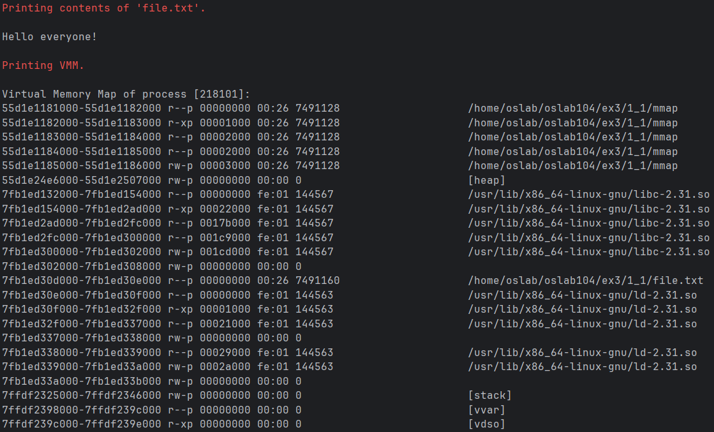
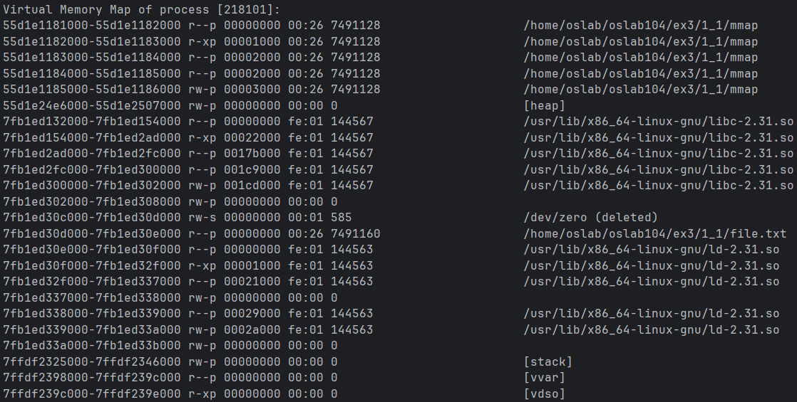
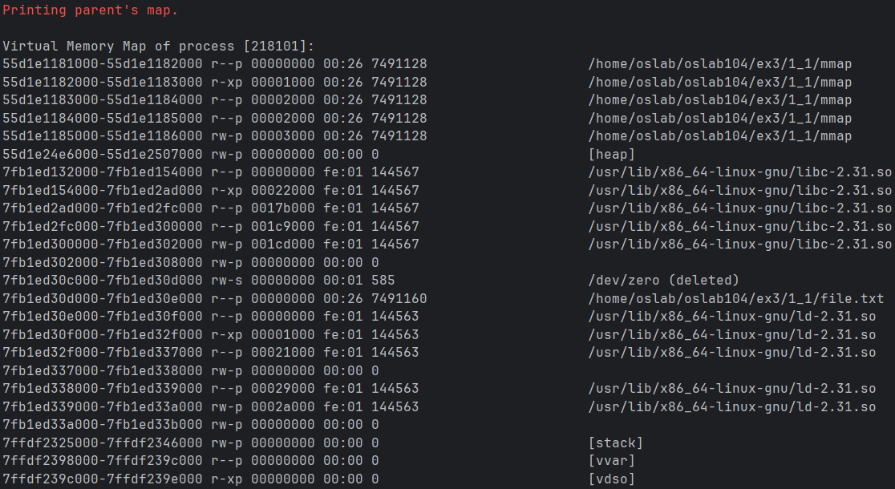
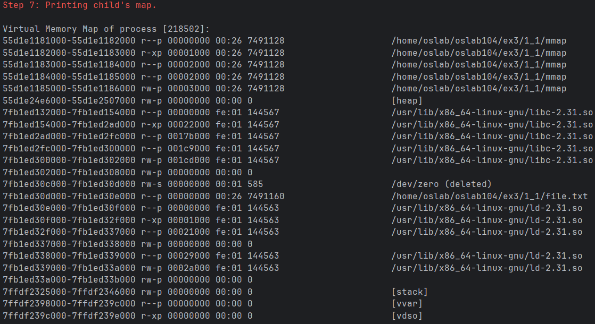
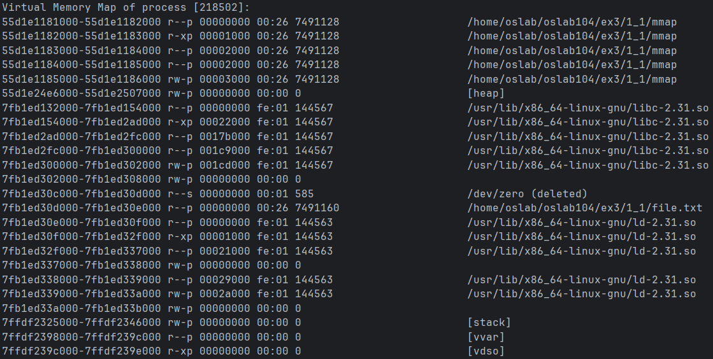

3η Εργαστηριακή Αναφορά
===

***Μανώλης Χατζηγεωργίου: el22082***

***Χρήστος Μπουκουβάλας: el22120***

## 1.1 Κλήσεις συστήματος και βασικοί μηχανισμοί του ΛΣ για τη διαχείριση της εικονικής μνήμης

1. Τυπώνουμε τον χάρτη μνήμης της διεργασίας
    

     
    

  - Παρατηρούμε πως ο χώρος λογικών διευθύνσεων περιορίζεται σε 48 εκ των 64 bits. Αυτό οδηγεί σε μικρότερα page tables 
    ενώ βοηθάει στο διαχωρισμό μνήμης διεργασίας και kernel μέσω του sign extension.
  - Επίσης παρατηρούμε πως χρησιμοποιείται ASLR (Address Space Layout Randomization) για προστασία από gadget attacks. 
  - Παράλληλα βλέπουμε πως οι πρώτες σελίδες του χώρου λογικών διευθύνσεων δεν είναι έγκυρες ως προστασία από null pointer dereferences.

2. Με την κλήση συστήματος `mmap()` δεσμεύουμε buffer μεγέθους μίας σελίδας (page) και τυπώνουμε ξανά το χάρτη.
    

     
    

  - Βλέπουμε πως έχει δημιουργηθεί ένα καινούργιο *anonymous* (not file backed) εύρος μεγέθους μίας σελίδας
   `7fb1ed337000-7fb1ed338000 rw-p 00000000 00:00 0`
    με δικαιώματα ανάγνωσης και εγγραφής *rw*. Το εύρος αυτό έχει επίσης την ιδιότητα protected *-p*, 
    δηλαδή αντιγράφεται μέσω του Copy On Write σε διεργασίες που το κληρονομούν.

3. Βρίσκουμε και τυπώνουμε τη φυσική διεύθυνση μνήμης στην οποία απεικονίζεται η εικονική διεύθυνση του buffer
    

      <pre><code>VA[0x7fb1ed337000] is not mapped; no physical memory allocated.
   </code></pre>
    

  - Παρατηρούμε πως δεν υπάρχει page entry το οποίο αντιστοιχεί τη λογική διεύθυνση του buffer σε φυσική.
    Αυτό είναι λογικό λόγω του demand paging, το οποίο δημιουργεί entries όταν γίνεται η πρώτη αναφορά στο page μνήμης.
    Η δημιουργία του buffer δεν προσμετράται ως αναφορά στη μνήμη (read - write) αλλά αλλάζει μόνο τον χάρτη μνήμης.

4. Γεμίζουμε με μηδενικά τον buffer και επαναλαμβάνουμε το βήμα 3
    

      <pre><code>Physical address: 0x1149ca000</code></pre>
    

  - Η πρώτη αναφορά στη μνήμη του buffer (εγγραφή πρώτης τιμής του σε 0) προκάλεσε page fault. Τότε το λειτουργικό
    ενεργοποιήθηκε, συμβουλεύτηκε τον χάρτη μνήμης και αφού επιβεβαίωσε την εγκυρότητα της αναφοράς δέσμευσε ένα page
    φυσικής μνήμης και δημιούργησε το αντίστοιχο entry στο page table, βάσει του demand paging που αναφέραμε παραπάνω.

5. Χρησιμοποιούμε τη `mmap()` για να απεικονίσουμε το αρχείο file.txt στον χώρο διευθύνσεων της διεργασίας και να τυπώνουμε το περιεχόμενό του.
   

     
   

 - Παρατηρούμε πως στον χάρτη μνήμης δημιουργήθηκε ένα νέο *file backed* εύρος μεγέθους μίας σελίδας 
   `7fb1ed30d000-7fb1ed30e000 r--p 00000000 00:26 7491160                    /home/oslab/oslab104/ex3/1_1/file.txt
   `με δικαιώματα ανάγνωσης *r* και την ιδιότητα protected *-p*.

6. Χρησιμοποιούμε την `mmap()` για να δεσμεύσουμε έναν νέο buffer, διαμοιραζόμενο
   (shared) αυτή τη φορά μεταξύ διεργασιών με μέγεθος μιας σελίδας.
   

     
   

 - Σε σύγκριση με την προηγούμενη εικόνα του χάρτη μνήμης εντοπίζουμε πως ο νέος *anonymus* buffer βρίσκεται στο εύρος 
   `7fb1ed30c000-7fb1ed30d000 rw-s 00000000 00:01 585                        /dev/zero (deleted)` και έχει δικαιώματα
   ανάγνωσης και εγγραφής. Παρατηρούμε πως δημιουργήθηκε με τη βοήθεια του αρχείου `/dev/zero`, οπότε αναμένουμε να είναι γεμάτος
   με bytes `\0`.

---

7. Τυπώνουμε τους χάρτες της εικονικής μνήμης της γονικής διεργασίας και της διεργασίας παιδιού
   

     
   

   

     
   

 - Παρατηρούμε πως δεν υπάρχει διαφορά ανάμεσα στους χάρτες μνήμης των δύο διεργασιών. Αυτό είναι λογικό αφού
   η `fork()` δημιουργεί αντίγραφο της διεργασίας η οποία την καλεί.

8. Βρίσκουμε και τυπώνουμε τη φυσική διεύθυνση στη κύρια μνήμη του private buffer του βήματος 3 για τις διεργασίες γονέα και παιδιού.
    

    <pre><code>Printing parent's private buffer physical address.
    Physical address: 0x1149ca000
    
    Printing child's private buffer physical address.
    Physical address: 0x1149ca000</code></pre>
    

 - Παρατηρούμε πως οι φυσικές διευθύνσεις είναι ίδιες παρόλο που ο buffer είναι shared (οπότε θα περιμέναμε να δημιουργηθεί αντίγραφο λόγω του `fork()`)
   Όμως λόγω του Copy On Write αυτές παραμένουν ίδιες, μέχρι κάποια από τις διεργασίες να εκτελέσει εγγραφή στον buffer, οπότε τότε εκτελείται αντιγραφή.

9. Γράφουμε στον private buffer από τη διεργασία παιδί και επαναλαμβάνουμε το βήμα 8
   

   <pre><code>Printing parent's private buffer physical address.
   Physical address: 0x1149ca000
    
   Printing child's private buffer physical address.
   Physical address: 0x1149ca000</code></pre>
   

 - Παρατηρούμε πως αφού υπήρξε εγγραφή, ενεργοποιήθηκε το Copy On Write και έτσι δημιουργήθηκε αντίγραφο του buffer στο παιδί, το οποίο έπειτα το τροποποίησε.
   Για αυτόν τον λόγο τώρα οι φυσικές διευθύνσεις διαφέρουν, αφού η μία δείχνει στον αρχικό buffer και η άλλη στο αντίγραφο.

10. Γράφουμε στον shared buffer του βήματος 6 από τη διεργασία παιδί και τυπώνουμε τη φυσική
    του διεύθυνση για τις διεργασίες γονέα και παιδιού.
   

   <pre><code>Printing parents's shared buffer physical address.
   Physical address: 0x183255000

   Printing child's shared buffer physical address.
   Physical address: 0x183255000</code></pre>
   

 - Παρατηρούμε πως σε αντίθεση με τον private buffer, η εγγραφή δεν ενεργοποίησε το Copy On Write.
   Αυτό είναι λογικό αφού ο παρών buffer είναι διαμοιραζόμενος (shared), άρα δεν αντιγράφεται μεταξύ των διεργασιών.

11. Απαγορεύουμε τις εγγραφές στον shared buffer για τη διεργασία παιδί.
   

     
   

 - Επιβεβαιώνουμε την απαγόρευση βλέποντας πως το εύρος `7fb1ed30c000-7fb1ed30d000 r--s 00000000 00:01 585                        /dev/zero (deleted)`
   (shared buffer) έχει μόνο δικαιώματα ανάγνωσης *r*. 

12. Αποδεσμεύουμε όλους τους buffers στις δύο διεργασίες

## 1.2 Παράλληλος υπολογισμός Mandelbrot με διεργασίες αντί για νήματα

### 1.2.1 Semaphores πάνω από διαμοιραζόμενη μνήμη

### 1.2.2 Υλοποίηση χωρίς semaphores

## 1.3 Επέκταση Άσκησης 1
