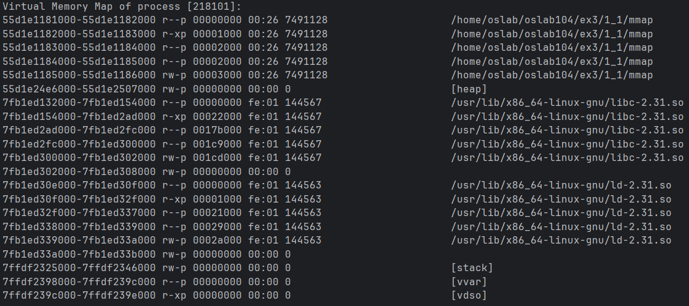

3η Εργαστηριακή Αναφορά
===

***Μανώλης Χατζηγεωργίου: el22082***

***Χρήστος Μπουκουβάλας: el22120***

## 1.1 Κλήσεις συστήματος και βασικοί μηχανισμοί του ΛΣ για τη διαχείριση της εικονικής μνήμης

1. Τυπώνουμε τον χάρτη μνήμης της διεργασίας
    

     
    

  - Παρατηρούμε πως ο χώρος λογικών διευθύνσεων περιορίζεται σε 48 εκ των 64 bits. Αυτό οδηγεί σε μικρότερα page tables 
    ενώ βοηθάει στο διαχωρισμό μνήμης διεργασίας και kernel μέσω του sign extension.
  - Επίσης παρατηρούμε πως χρησιμοποιείται ASLR (Address Space Layout Randomization) για προστασία από gadget attacks. 
  - Παράλληλα βλέπουμε πως οι πρώτες σελίδες του χώρου λογικών διευθύνσεων δεν είναι έγκυρες ως προστασία από null pointer dereferences.

2. Με την κλήση συστήματος mmap() δεσμεύουμε buffer μεγέθους μίας σελίδας (page) και τυπώνουμε ξανά το χάρτη.
    

     
    

  - Βλέπουμε πως έχει δημιουργηθεί ένα καινούργιο *anonymous* (not file backed) εύρος μεγέθους μίας σελίδας
   `7fb1ed337000-7fb1ed338000 rw-p 00000000 00:00 0`
    με δικαιώματα ανάγνωσης και εγγραφής *rw*. Το εύρος αυτό έχει επίσης την ιδιότητα protected *-p*, 
    δηλαδή αντιγράφεται μέσω του Copy On Write σε διεργασίες που το κληρονομούν.

3. Βρείτε και τυπώστε τη φυσική διεύθυνση μνήμης στην οποία απεικονίζεται η εικονική διεύθυνση του buffer (τη διεύθυνση όπου βρίσκεται αποθηκευμένος στη
      φυσική κύρια μνήμη). Τι παρατηρείτε και γιατί;

## 1.2 Παράλληλος υπολογισμός Mandelbrot με διεργασίες αντί για νήματα

### 1.2.1 Semaphores πάνω από διαμοιραζόμενη μνήμη

### 1.2.2 Υλοποίηση χωρίς semaphores

## 1.3 Επέκταση Άσκησης 1
